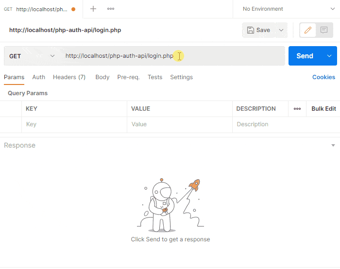

"# ecommerce_api" 
 
 
POST :  
    - Login  (OK)  
    - Register (OK)  
 
Get :  
    -  Get all product  
    -  Search for product  
    -  Get details of product  
 
To test using POSTMAN (https://www.postman.com/)
 

